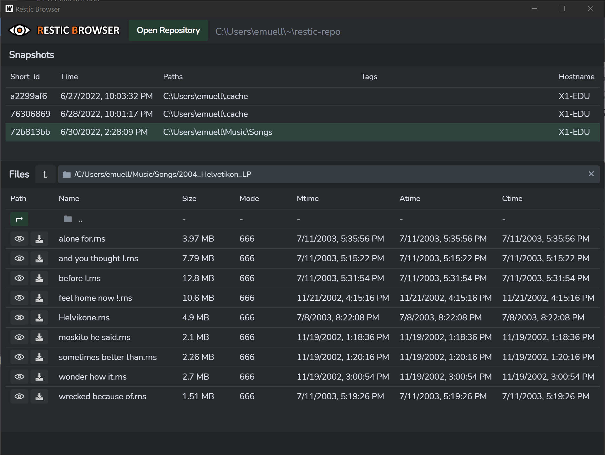

# Restic Browser

A simple, cross-platform [restic backup](https://github.com/restic/restic) GUI for browsing and restoring restic repositories. 

Built with [Wails2](https://wails.io), based on leaanthony's [Restoric](https://github.com/leaanthony/restoric) PoC. 

## Features

* *Displays* contents (snapshots, files) of local restic repositories (browsing remote repositories is WIP).
* *Restores* selected files or folders (as zip archives) to a desired location 
* *Previews* selected files by moving them to the temp and then opening them with your OSs associated default program.

This is not a restic backup tool GUI - it only allows you to *browse* existing repositories!  

## Development

### Dependencies

* Follow the [Wails2 Installation Docs](https://wails.io/docs/gettingstarted/installation) to install Wails2 for your platform.
* Install [restic](https://github.com/restic/restic/releases/) and *make sure it is included in your $PATH*. 

### Frontend and App Development

To work in live development mode with automatic hot-reloading, run `wails dev` in the root directory. 

### Go Backend Debugging

To debug the Wails Go application code, you can use the existing startup tasks of vscode. If you press "F5" in vscode, the application will be built in debug mode and then will be launched.   

### Build Production Packages

To build a redistributable package in production mode, use `wails build -tags production,desktop` or use the default build task in vscode.

## License

MIT license. See [LICENSE](./LICENSE) for the full text.

## Contribute

Patches are welcome! Please fork the latest git repository and create a feature branch. 
